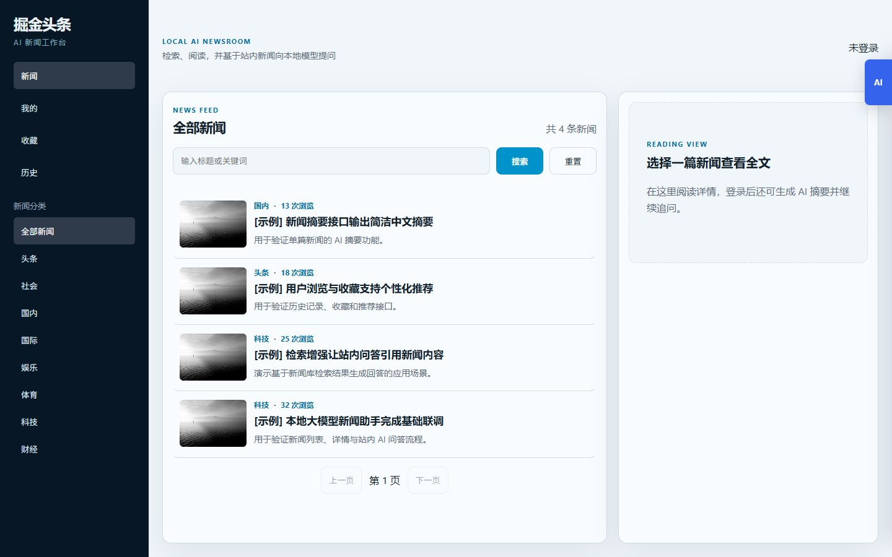
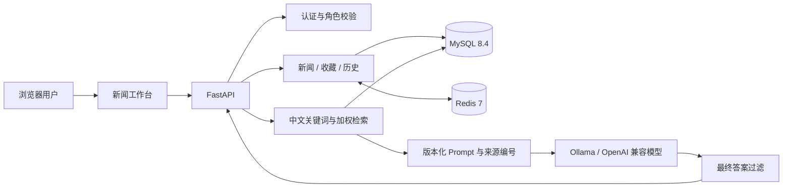

# 掘金头条 · AI 新闻助手

[](https://github.com/fantasy123699/ai-news-assistant/actions/workflows/backend-ci.yml)

一个面向新闻阅读场景的大模型应用项目。系统将新闻检索、文章摘要、基于原文的问答、站内 RAG 问答和用户行为功能整合到同一个 Web 工作台，并提供可复现的 Docker 环境、自动化测试和模型输出评测。

> 当前定位是本地作品演示与工程实践，不是可直接用于公网生产环境的部署方案。



## 项目亮点

- **可解释的 RAG 检索**：提取中文关键词与新闻分类，对标题、简介、正文分别赋予 5、3、1 的权重；无命中时按分类和时间回退。
- **有来源约束的回答**：检索结果使用 `来源N` 编号进入上下文，回答需要逐条引用对应新闻，接口同时返回引用记录。
- **可追踪的 Prompt**：站内问答 Prompt 独立维护并带版本号，方便定位模型行为变化和关联评测结果。
- **模型质量评测**：提供 Hit@K 检索评测与确定性的引用覆盖检查，避免只依赖人工体验判断效果。
- **可靠的异步模型调用**：基于 `httpx` 支持 Ollama、LM Studio、vLLM 等 OpenAI 兼容服务，并实现超时、有限重试、指数退避和安全错误映射。
- **只展示最终答案**：新闻摘要在保存和返回前过滤模型的 `think`、`analysis`、`reasoning` 推理内容。
- **完整应用能力**：包含登录与角色边界、新闻管理、Redis 缓存、收藏、浏览历史、AI 摘要和文章问答。
- **工程化交付**：Python 3.12、非 root 容器、MySQL/Redis 健康检查、GitHub Actions 和 30 项自动化测试。

## 核心流程



站内 AI 问答会依次执行分类与关键词识别、MySQL 加权检索、来源编号、版本化 Prompt 构建和异步模型调用，最后返回回答、引用新闻、Prompt 版本与检索信息。

## 功能范围

| 模块 | 已实现能力 |
| --- | --- |
| 新闻 | 分类、搜索、分页、详情、相关推荐、管理员增删改 |
| 用户 | 注册、登录、退出、资料维护、密码哈希、用户/管理员角色边界 |
| 收藏与历史 | 收藏检查、添加、取消、清空、浏览记录与单条删除 |
| AI 阅读助手 | 单篇新闻摘要、基于原文的追问、最终答案过滤 |
| 站内 AI 助手 | 加权检索、分类回退、来源引用、新闻推荐 |
| 质量保障 | 单元测试、检索评测、引用覆盖评测、OpenAPI 与依赖检查 |

## 技术栈

| 层次 | 技术 |
| --- | --- |
| Web / API | FastAPI、原生 HTML/CSS/JavaScript |
| 数据与缓存 | SQLAlchemy 2、aiomysql、MySQL 8.4、Redis 7 |
| 大模型 | Ollama 或 OpenAI 兼容接口、DeepSeek-R1 默认模型 |
| 检索与评测 | jieba、加权词法检索、Hit@K、引用覆盖检查 |
| 工程化 | Docker Compose、GitHub Actions、Python unittest |

## 快速启动

准备 Docker Desktop，以及可访问的 Ollama 或 OpenAI 兼容模型服务。项目默认从容器访问宿主机的 `http://host.docker.internal:11435`，默认模型为 `deepseek-r1:1.5b`。

如果 Ollama 使用常见的 `11434` 端口，在 PowerShell 中执行：

```powershell
$env:CONTAINER_LLM_BASE_URL = "http://host.docker.internal:11434"
docker compose up -d --build
```

如果模型服务已经监听 `11435`，直接运行：

```powershell
docker compose up -d --build
```

启动后访问：

- Web 工作台：<http://localhost:8000>
- 健康检查：<http://localhost:8000/health>
- OpenAPI 文档：<http://localhost:8000/docs>

查看状态或停止服务：

```powershell
docker compose ps
docker compose down
```

完整的端口、数据重置和生产边界说明见 [容器运行说明](docs/container-run.md)。

## 测试与评测

```powershell
py -3 -m venv .venv
.\.venv\Scripts\python.exe -m pip install -r requirements.txt
.\.venv\Scripts\python.exe -m unittest discover -s tests -v
.\.venv\Scripts\python.exe scripts/evaluate_faithfulness.py
```

当前检查结果：

- 30 项自动化测试通过。
- 引用覆盖离线样例 4/4 通过。
- CI 同时检查 Compose 配置、Python 编译、OpenAPI 生成和依赖完整性。

数据库和示例数据可用后，可以运行检索 Hit@K 评测：

```powershell
.\.venv\Scripts\python.exe scripts/evaluate_retrieval.py
```

评测边界见 [RAG 检索说明](docs/rag-retrieval.md) 与 [Prompt 评测说明](docs/prompt-evaluation.md)。

## 项目结构

```text
ai-news-assistant/
├─ toutiao_backend/
│  ├─ routers/          # 新闻、用户、收藏、历史和 AI 接口
│  ├─ crud/             # 数据访问与检索 SQL
│  ├─ models/           # SQLAlchemy 模型
│  ├─ schemas/          # 请求与响应校验
│  ├─ utils/            # 模型客户端、检索、Prompt、评测与缓存
│  └─ static/           # Web 工作台
├─ database/            # 建表、示例数据和增量迁移
├─ evals/               # 检索与回答评测样例
├─ scripts/             # 可重复执行的评测入口
├─ tests/               # 自动化测试
└─ .github/workflows/   # 持续集成
```

## 当前边界与后续方向

- 当前 RAG 使用适合小型新闻数据集的可解释词法检索；在积累真实匿名查询并完成基线评测前，不盲目引入向量数据库。
- Compose 面向本地复现，公开部署仍需要生产密钥、HTTPS、备份、迁移和回滚验证。
- 后续优先完善前端引用展示、流式回答、MySQL 集成测试和会话安全，不将尚未实现的 Agent 能力写入项目声明。

## 进一步阅读

- [模型客户端与失败处理](docs/llm-client.md)
- [RAG 检索与 Hit@K 评测](docs/rag-retrieval.md)
- [Prompt 版本与引用覆盖评测](docs/prompt-evaluation.md)
- [持续集成说明](docs/continuous-integration.md)
- [完整优化日志](docs/optimization-log.md)
